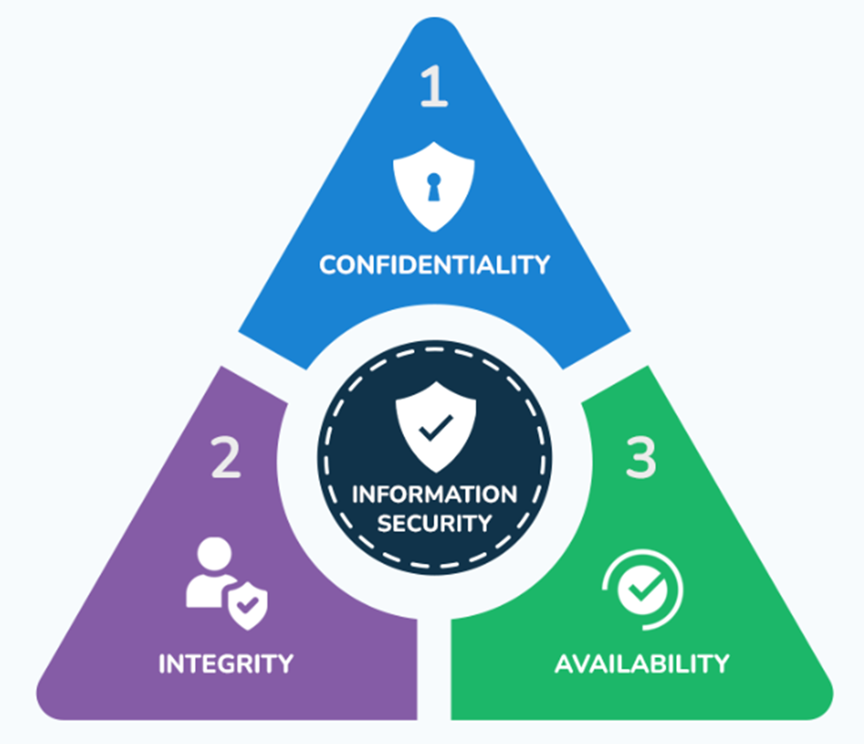

# 🔐 Cybersecurity Essentials: ພື້ນຖານຄວາມປອດໄພດີຈິຕອນ

### ບົດຮຽນ 1 ຊົ່ວໂມງ — ສຳລັບຜູ້ເລີ່ມຕົ້ນ (Beginner Level)

---

## 1. Cybersecurity ແມ່ນຫຍັງ?

**Cybersecurity** (ຄວາມປອດໄພທາງໄຊເບີ) ແມ່ນການປະຕິບັດເພື່ອປ້ອງກັນ **ຊັບສິນດີຈິຕອນ** ເຊັ່ນ: ລະບົບຄອມພິວເຕີ, ເຄືອຂ່າຍ, ແລະ ຂໍ້ມູນສຳຄັນ ຈາກການໂຈມຕີ, ການເຂົ້າເຖິງໂດຍບໍ່ໄດ້ຮັບອະນຸຍາດ ຫຼື ຄວາມເສຍຫາຍທຸກຮູບແບບ.

### 🏰 ການປຽບທຽບ: ໂລກຕົວຈິງ vs ໂລກດີຈິຕອນ

| ມາດຕະການປ້ອງກັນ            | ໂລກຕົວຈິງ (Physical) | ໂລກດີຈິຕອນ (Digital)           |
| :------------------------- | :------------------- | :----------------------------- |
| **ການລັອກ/ການອະນຸຍາດ**     | ກະແຈ ແລະ ລູກບິດ      | **Password & MFA**             |
| **ການກັ່ນຕອງຜູ້ເຂົ້າ-ອອກ** | ຮົ້ວ ແລະ ປະຕູໂຂງ     | **Firewall**                   |
| **ການກວດສອບ**              | ຍາມຮັກສາຄວາມປອດໄພ    | **Intrusion Detection (IDS)**  |
| **ການຮັກສາຄວາມລັບ**        | ຕູ້ເຊັບ (Safe)       | **Encryption** (ການເຂົ້າລະຫັດ) |
| **ການຕິດຕາມພຶດຕິກຳ**       | ກ້ອງວົງຈອນປິດ (CCTV) | **Activity Logs** (ການບັນທຶກ)  |

---

## 2. CIA Triad: 3 ເສົາຫຼັກຂອງຄວາມປອດໄພ

**CIA Triad** ແມ່ນຫຼັກການພື້ນຖານທີ່ນັກຊ່ຽວຊານ Cybersecurity ໃຊ້ໃນການປະເມີນ ແລະ ວາງລະບົບປ້ອງກັນຂໍ້ມູນ.

### 🔒 C — Confidentiality (ຄວາມລັບ)

ການຮັບປະກັນວ່າຂໍ້ມູນຈະຖືກເຂົ້າເຖິງໄດ້ **ສະເພາະຜູ້ທີ່ມີສິດ** ເທົ່ານັ້ນ.

- ✅ **ຕົວຢ່າງ:** ລະຫັດ PIN ທະນາຄານ ຫຼື ຂໍ້ມູນສ່ວນຕົວຄວນເຫັນໄດ້ສະເພາະເຈົ້າຂອງ.
- ❌ **ໄພຄຸກຄາມ:** ການລັກຂໍ້ມູນ (Data Breach) ຫຼື ການດັກຟັງຂໍ້ມູນ.

### ✅ I — Integrity (ຄວາມຖືກຕ້ອງ)

ການຮັບປະກັນວ່າຂໍ້ມູນຕ້ອງ **ຖືກຕ້ອງ, ຄົບຖ້ວນ** ແລະ ບໍ່ຖືກດັດແກ້ໂດຍພະລະການ.

- ✅ **ຕົວຢ່າງ:** ຍອດເງິນໃນບັນຊີຕ້ອງບໍ່ຖືກປ່ຽນແປງໂດຍບໍ່ມີການເຮັດທຸລະກຳຈິງ.
- ❌ **ໄພຄຸກຄາມ:** ການແກ້ໄຂຖານຂໍ້ມູນ ຫຼື ການປອມແປງຂໍ້ມູນ (Data Tampering).

### 🌐 A — Availability (ສະພາບພ້ອມໃຊ້)

ການຮັບປະກັນວ່າລະບົບ ແລະ ຂໍ້ມູນຕ້ອງ **ພ້ອມໃຊ້ງານສະເໝີ** ເມື່ອມີການຮ້ອງຂໍ.

- ✅ **ຕົວຢ່າງ:** ເວັບໄຊທະນາຄານ ຫຼື ລະບົບໂຮງໝໍຕ້ອງ Online ຕະຫຼອດ 24/7.
- ❌ **ໄພຄຸກຄາມ:** ການໂຈມຕີ DDoS ທີ່ເຮັດໃຫ້ເວັບໄຊລົ້ມ.

---

> 💡 **Professional Insight:** ຄວາມປອດໄພໄຊເບີ 90% ເລີ່ມຕົ້ນທີ່ **"ຄົນ"**. ເຖິງວ່າເຮົາຈະມີເທັກໂນໂລຊີທີ່ທັນສະໄໝທີ່ສຸດ, ແຕ່ຖ້າຜູ້ໃຊ້ງານຂາດຄວາມລະມັດລະວັງ, ລະບົບກໍຍັງມີຊ່ອງໂຫວ່ທີ່ອັນຕະລາຍທີ່ສຸດ.

## 3. ໄພຄຸກຄາມທາງດ້ານ Cyber (Common Cyber Threats)

ໃນການປ້ອງກັນລະບົບ, ພວກເຮົາຕ້ອງເຂົ້າໃຈກ່ອນວ່າ **"ແຮກເກີໂຈມຕີແນວໃດ?"**. ສູດພື້ນຖານຂອງໄພຄຸກຄາມມີດັ່ງນີ້:

> ⚠️ **ໄພຄຸກຄາມ = ແຮງຈູງໃຈ (Motive) + ໂອກາດ (Opportunity) + ຄວາມສາມາດ (Capability)**
> _ຖ້າພວກເຮົາປິດ "ໂອກາດ" (ຊ່ອງໂຫວ່), ການໂຈມຕີກໍຈະເກີດຂຶ້ນໄດ້ຍາກ._

---

### 🦠 1. Malware (ຊອບແວອັນຕະລາຍ)

**Malware** ແມ່ນຊອບແວທີ່ຖືກສ້າງຂຶ້ນເພື່ອແນໃສ່ສ້າງຄວາມເສຍຫາຍ ຫຼື ເຂົ້າເຖິງຂໍ້ມູນໂດຍບໍ່ໄດ້ຮັບອະນຸຍາດ.

| ປະເພດ          | ລັກສະນະການທຳງານ                                                | ຕົວຢ່າງເຫດການຈິງ | ລາຍລະອຽດ (Details)                                          |
| :------------- | :------------------------------------------------------------- | :--------------- | :---------------------------------------------------------- |
| **Virus**      | ຕ້ອງອາໄສໄຟລ໌ "ພາຫະນະ" ໃນການແຜ່ລາມ ແລະ ທຳລາຍຂໍ້ມູນ              | ILOVEYOU (2000)  | ສົ່ງຜ່ານ Email ຫົວຂໍ້ "ILOVEYOU", ທຳລາຍໄຟລ໌ຮູບພາບ ແລະ ເພງ.  |
| **Worm**       | ແຜ່ລາມດ້ວຍຕົນເອງຜ່ານເຄືອຂ່າຍໄດ້ຢ່າງວ່ອງໄວໂດຍບໍ່ຕ້ອງອາໄສຄົນເປີດ | Stuxnet (2010)   | ເຈາະຈົງທຳລາຍລະບົບຄວບຄຸມໂຮງງານນິວເຄຼຍຂອງອີຣ່ານ.              |
| **Trojan**     | ປອມແປງມາໃນຮູບແບບໂປຣແກຣມທີ່ມີປະໂຫຍດ ແຕ່ແຝງອັນຕະລາຍໄວ້           | Emotet           | ເລີ່ມຈາກການລັກຂໍ້ມູນທະນາຄານ ແລະ ກາຍເປັນຕົວແຜ່ກະຈາຍ Malware. |
| **Ransomware** | ເຂົ້າລະຫັດລັອກໄຟລ໌ທັງໝົດ ແລ້ວຮຽກຄ່າໄຖ່ເປັນ Cryptocurrency      | WannaCry (2017)  | ໂຈມຕີລະບົບ Windows ທົ່ວໂລກ, ລວມເຖິງລະບົບໂຮງໝໍຂະໜາດໃຫຍ່.     |
| **Spyware**    | ແອບຕິດຕາມພຶດຕິກຳ, ບັນທຶກການພິມ (Keylogger) ເພື່ອລັກລະຫັດ       | Pegasus          | ຊອບແວສອດແນມລະດັບສູງທີ່ໃຊ້ເຈາະຂໍ້ມູນ Smartphone ບຸກຄົນສຳຄັນ. |

---

### 🎣 2. Phishing (ການຫລອກລວງທາງດິຈິຕອນ)

Phishing ແມ່ນການໃຊ້ **Email, SMS (Smishing), ຫຼື ການໂທ (Vishing)** ທີ່ປອມແປງມາຈາກແຫຼ່ງທີ່ໜ້າເຊື່ອຖື ເພື່ອລໍ້ໃຫ້ເຫຍື່ອປ້ອນຂໍ້ມູນສຳຄັນ.

**🚩 ສັນຍານເຕືອນ (Red Flags):**

- **Urgency:** ໃຊ້ພາສາທີ່ເລັ່ງດ່ວນ ("ບັນຊີຂອງທ່ານຈະຖືກປິດພາຍໃນ 24 ຊົ່ວໂມງ").
- **Mismatched URL:** ເມື່ອເອົາ Mouse ໄປຊີ້ໃສ່ລິ້ງ, ທີ່ຢູ່ວົງເລັບບໍ່ກົງກັບຊື່ເວັບໄຊຈິງ.
- **Grammar & Spelling:** ມີການຂຽນຜິດໄວຍາກອນ ຫຼື ໃຊ້ຕົວອັກສອນແປກໆ (ເຊັ່ນ: `Paypa1` ແທນ `Paypal`).

---

### 🧠 3. Social Engineering (ການຫລອກລວງດ້ານຈິດຕະສາດ)

ແທນທີ່ຈະເຈາະລະບົບຄອມພິວເຕີ, ແຮກເກີເລືອກທີ່ຈະ **"ເຈາະຈິດໃຈຄົນ"**. ມັນແມ່ນການຫລອກໃຫ້ມະນຸດເປີດເຜີຍຄວາມລັບເອງ.

- **Pretexting:** ສ້າງເລື່ອງລາວປອມ ເຊັ່ນ: ອ້າງວ່າເປັນ IT Support ມາຂໍ Reset ລະຫັດຜ່ານ.
- **Baiting:** ການວາງ "ເຫຍື່ອ" ເຊັ່ນ: ວາງ USB Drive ທີ່ມີ Malware ໄວ້ໃນບ່ອນສາທາລະນະ ເພື່ອໃຫ້ຄົນເກັບໄປສຽບໃສ່ຄອມ.
- **Tailgating:** ການແອບຍ່າງຕາມຫຼັງພະນັກງານເຂົ້າໄປໃນເຂດຫວງຫ້າມໂດຍບໍ່ໄດ້ໃຊ້ບັດສະແກນ.

---

### 🕵️ 4. Man-in-the-Middle (MitM)

ຜູ້ໂຈມຕີແອບ **"ດັກຟັງ"** ຢູ່ກາງການສື່ສານລະຫວ່າງ 2 ຝ່າຍ ເພື່ອອ່ານ ຫຼື ດັດແປງຂໍ້ມູນທີ່ສົ່ງຫາ ກັນ.

> ⚠️ **ຄຳເຕືອນ:** ຫຼີກເວັ້ນການເຂົ້າໃຊ້ແອັບທະນາຄານ ຫຼື ປ້ອນລະຫັດຜ່ານເມື່ອເຊື່ອມຕໍ່ **Free Wi-Fi** ຕາມຮ້ານກາເຟ ຫຼື ສະໜາມບິນ ທີ່ບໍ່ມີລະບົບປ້ອງກັນ.

---

### 💥 5. DDoS Attack

**Distributed Denial of Service** ແມ່ນການໃຊ້ຄອມພິວເຕີຈຳນວນມະຫາສານທີ່ຕິດເຊື້ອ (Botnet) ສົ່ງ Traffic ໄປຖະລົ່ມ Server ດຽວ ຈົນລະບົບຮັບບໍ່ໄຫວ ແລະ ລົ້ມໃນທີ່ສຸດ.

- **ເປົ້າໝາຍ:** ທຳລາຍສະພາບພ້ອມໃຊ້ງານ (**Availability**) ຂອງລະບົບ.

---

### 👥 6. Insider Threats (ໄພຄຸກຄາມຈາກພາຍໃນ)

ໄພຄຸກຄາມທີ່ມາຈາກຄົນພາຍໃນອົງກອນ (ພະນັກງານ, ຄູ່ຄ້າ) ເຊິ່ງມີສິດເຂົ້າເຖິງລະບົບຢູ່ແລ້ວ.

1.  **Malicious:** ຕັ້ງໃຈລັກຂໍ້ມູນ ຫຼື ທຳລາຍລະບົບຍ້ອນຄວາມແຄ້ນ.
2.  **Negligent:** ເຮັດໃຫ້ຂໍ້ມູນຮົ່ວໄຫຼຍ້ອນຄວາມປະມາດ (ເຊັ່ນ: ເຮັດ Laptop ເສຍ ຫຼື ຕິດ Phishing).

---

> 💡 **Next Step:** ໃນບົດຕໍ່ໄປ ພວກເຮົາຈະມາຮຽນຮູ້ **"ຄຳສັບສຳຄັນ"** ທີ່ນັກ Cybersecurity ຕ້ອງໃຊ້ໃນການສື່ສານມືອາຊີບ.

## 4. ຄຳສັບສຳຄັນທີ່ຕ້ອງຮູ້ (Key Security Terminology)

ເພື່ອສື່ສານກັບທີມງານ IT ແລະ ເຂົ້າໃຈບົດລາຍງານຄວາມປອດໄພ, ນີ້ແມ່ນຄຳສັບພື້ນຖານທີ່ນັກຊ່ຽວຊານ Cybersecurity ຕ້ອງໃຊ້:

### 📑 ຕາຕະລາງຄຳສັບພື້ນຖານ

| ຄຳສັບ (Terms)        | ຄຳອ່ານ              | ຄວາມໝາຍທາງເຕັກນິກ                                                               |
| :------------------- | :------------------ | :------------------------------------------------------------------------------ |
| **Vulnerability**    | ວັນ-ເນີ-ຣາ-ບິ-ລິ-ຕີ | **ຊ່ອງໂຫວ່:** ຈຸດອ່ອນໃນຊອບແວ ຫຼື ລະບົບທີ່ແຮກເກີສາມາດໃຊ້ບຸກລຸກໄດ້.               |
| **Exploit**          | ເອັກ-ສ-ພລ໋ອຍ        | **ການສວຍໃຊ້:** ເຄື່ອງມື ຫຼື ວິທີການທີ່ໃຊ້ເພື່ອເຈາະຜ່ານຊ່ອງໂຫວ່ (Vulnerability). |
| **Patch**            | ແພດ                 | **ຕົວແກ້ໄຂ:** ຊອບແວອັບເດດທີ່ຖືກປ່ອຍອອກມາເພື່ອປິດຊ່ອງໂຫວ່ທີ່ພົບເຫັນ.             |
| **Zero-Day**         | ຊີ-ໂຣ-ເດ            | ຊ່ອງໂຫວ່ໃໝ່ທີ່ **ຍັງບໍ່ມີ Patch** ແກ້ໄຂ (ເປັນຈຸດທີ່ອັນຕະລາຍທີ່ສຸດ).             |
| **Payload**          | ເພ-ໂຫຼດ             | ສ່ວນຂອງ Code ຫຼື Malware ທີ່ເຮັດວຽກຈິງ (ເຊັ່ນ: Code ທີ່ສັ່ງລຶບຂໍ້ມູນ).          |
| **Firewall**         | ໄຟ-ວໍ               | ລະບົບກວດສອບ ແລະ ກັ່ນຕອງຂໍ້ມູນ (Traffic) ທີ່ເຂົ້າ-ອອກເຄືອຂ່າຍ.                   |
| **Penetration Test** | ເພນ-ເທດ             | **ການທົດສອບເຈາະລະບົບ:** ການຈ້າງແຮກເກີຝ່າຍດີມາຊອກຊ່ອງໂຫວ່ (Ethical Hacking).     |

---

### 🛡️ ຄວາມແຕກຕ່າງລະຫວ່າງ Authentication ແລະ Authorization

ຫຼາຍຄົນມັກສັບສົນ 2 ຄຳນີ້, ແຕ່ໃນທາງ Security ມັນມີໜ້າທີ່ຕ່າງກັນ:

1.  **Authentication (ການຢືນຢັນຕົວຕົນ):** "ທ່ານແມ່ນໃຜ?" (Who are you?)
    - _ຕົວຢ່າງ:_ ການປ້ອນ Username ແລະ Password.
2.  **Authorization (ການກວດສອບສິດ):** "ທ່ານມີສິດເຮັດຫຍັງໄດ້ແດ່?" (What can you do?)
    - _ຕົວຢ່າງ:_ ພະນັກງານທົ່ວໄປເບິ່ງໄດ້ແຕ່ໄຟລ໌ຂອງຕົນເອງ, ແຕ່ Admin ສາມາດລຶບໄຟລ໌ໄດ້ທຸກຢ່າງ.

---

### 🔒 ພື້ນຖານການເຂົ້າລະຫັດ (Cryptography 101)

ການເຂົ້າລະຫັດ (Encryption) ແມ່ນການປ່ຽນຂໍ້ມູນທີ່ອ່ານໄດ້ (Plaintext) ໃຫ້ກາຍເປັນລະຫັດທີ່ອ່ານບໍ່ຮູ້ເລື່ອງ (Ciphertext).

#### ວິທີທີ່ນິຍົມທີ່ສຸດ: Asymmetric Encryption (ກຸນແຈຄູ່)

ຈິນຕະນາການວ່າທ່ານມີ **"ກ້ອງຮັບຈົດໝາຍ"** ທີ່ມີກຸນແຈ 2 ດ່ານ:

- **🔑 Public Key (ກຸນແຈສາທາລະນະ):** ທ່ານແຈກກຸນແຈດ່ານນີ້ໃຫ້ທຸກຄົນ. ໃຜກໍໄດ້ສາມາດໃຊ້ກຸນແຈນີ້ເພື່ອ **"ລັອກ"** ແລະ ຢ່ອນຈົດໝາຍເຂົ້າຕູ້ຂອງທ່ານ.
- **🗝️ Private Key (ກຸນແຈສ່ວນຕົວ):** ກຸນແຈດ່ານນີ້ມີ **ສະເພາະທ່ານດຽວເທົ່ານັ້ນ** ທີ່ຖືໄວ້. ມັນໃຊ້ສຳລັບ **"ໄຂ"** ເພື່ອອ່ານຈົດໝາຍທີ່ຖືກລັອກມາ.

> 💡 **Professional Tip:** ລະບົບເວັບໄຊທີ່ປອດໄພ (HTTPS) ໃຊ້ຫຼັກການນີ້ເພື່ອຮັບປະກັນວ່າ ຂໍ້ມູນທີ່ທ່ານສົ່ງຫາເວັບໄຊ (ເຊັ່ນ: ລະຫັດຜ່ານ) ຈະບໍ່ມີໃຜແອບອ່ານໄດ້ຢູ່ກາງທາງ.

---

## 5. ສາຍອາຊີບ ແລະ ຈັນຍາບັນ (Careers & Ethics)

Cybersecurity ແມ່ນຂະແໜງການທີ່ມີອັດຕາການເຕີບໂຕສູງ ແລະ ເປັນທີ່ຕ້ອງການຂອງຕະຫຼາດແຮງງານທົ່ວໂລກ.

### ⚔️ ບົດບາດພາຍໃນອົງກອນ (The Color Teams)

ໃນການເຮັດວຽກຕົວຈິງ, ນັກຊ່ຽວຊານຈະຖືກແບ່ງອອກເປັນທີມຕາມໜ້າທີ່ຄວາມຮັບຜິດຊອບ:

- 🔴 **Red Team (Offensive Security):** ເຮັດໜ້າທີ່ເປັນ "ແຮກເກີຝ່າຍດີ" ເພື່ອທົດສອບເຈາະລະບົບ, ຊອກຫາຊ່ອງໂຫວ່ ແລະ ຈຳລອງການໂຈມຕີຈິງ.
  - _ອາຊີບ:_ Penetration Tester, Ethical Hacker.
- 🔵 **Blue Team (Defensive Security):** ເຮັດໜ້າທີ່ປ້ອງກັນ, ເຝົ້າລະວັງ ແລະ ຕອບໂຕ້ເມື່ອເກີດເຫດການໂຈມຕີ.
  - _ອາຊີບ:_ Security Analyst, Incident Responder, SOC Analyst.
- 💜 **Purple Team:** ການເຮັດວຽກຮ່ວມກັນລະຫວ່າງຝ່າຍບຸກ ແລະ ຝ່າຍຮັບ ເພື່ອແລກປ່ຽນຂໍ້ມູນ ແລະ ເສີມສ້າງຄວາມປອດໄພໃຫ້ແຂງແຮກກວ່າເກົ່າ.

### �️ ຕົວຢ່າງ: Web Pentesting (ການທົດສອບເຈາະເວັບໄຊ)

| ຝ່າຍ             | ກິດຈະກຳ (Activity)     | ລາຍລະອຽດ (Details)                                                   |
| :--------------- | :--------------------- | :------------------------------------------------------------------- |
| 🔴 **Red Team**  | **SQL Injection**      | ພະຍາຍາມແຊກຄຳສັ່ງ SQL ຜ່ານຟອມເພື່ອລັກຂໍ້ມູນໃນຖານຂໍ້ມູນ.               |
| 🔵 **Blue Team** | **Input Validation**   | ວາງລະບົບກວດສອບ ແລະ ກັ່ນຕອງຂໍ້ມູນທີ່ຜູ້ໃຊ້ປ້ອນເຂົ້າທຸກຈຸດ.            |
| 🔴 **Red Team**  | **Broken Auth**        | ເດົາລະຫັດຜ່ານ ຫຼື ຫາທາງຂ້າມລະບົບ Login ດ້ວຍວິທີຕ່າງໆ.                |
| 🔵 **Blue Team** | **MFA Implementation** | ບັງຄັບໃຊ້ການຢືນຢັນຕົວຕົນຫຼາຍຊັ້ນ (OTP/App) ເພື່ອປ້ອງກັນການເຂົ້າເຖິງ. |
| 🔴 **Red Team**  | **Brute Force**        | ພະຍາຍາມລອງລະຫັດຜ່ານຫຼາຍໆຄັ້ງຢ່າງຕໍ່ເນື່ອງດ້ວຍໂປຣແກຣມອັດຕະໂນມັດ.      |
| 🔵 **Blue Team** | **Rate Limiting**      | ຈຳກັດຈຳນວນຄັ້ງໃນການ Login ພາຍໃນເວລາທີ່ກຳນົດ ເພື່ອຢຸດການເດົາລະຫັດ.    |

---

### ⚖️ ຈັນຍາບັນຂອງນັກ Cybersecurity (Ethics)

ຄວາມຮູ້ດ້ານໄຊເບີປຽບເໝືອນ "ດາບສອງຄົມ". ຄວາມແຕກຕ່າງລະຫວ່າງ **Cyber Criminal** (ອາດຊະຍາກອນ) ແລະ **Cyber Professional** (ມືອາຊີບ) ຄື **ຈັນຍາບັນ ແລະ ກົດໝາຍ**.

1.  **Permission (ການອະນຸຍາດ):** ຢ່າທົດສອບເຈາະລະບົບໃດໆ ໂດຍບໍ່ໄດ້ຮັບອະນຸຍາດເປັນລາຍລັກອັກສອນ.
2.  **Integrity (ຄວາມຊື່ສັດ):** ບໍ່ນຳຂໍ້ມູນທີ່ພົບເຫັນໄປໃຊ້ເພື່ອຜົນປະໂຫຍດສ່ວນຕົວ ຫຼື ເປີດເຜີຍໂດຍບໍ່ໄດ້ຮັບອະນຸຍາດ.
3.  **No Harm (ບໍ່ສ້າງຄວາມເສຍຫາຍ):** ການທົດສອບຕ້ອງບໍ່ກະທົບຕໍ່ການເຮັດວຽກຂອງລະບົບຈິງ.

> ⚠️ **ຈື່ໄວ້ວ່າ:** ການ Hack ໂດຍບໍ່ໄດ້ຮັບອະນຸຍາດ **ຜິດກົດໝາຍ** ແລະ ມີໂທດທາງອາຍາ. ຄວາມຮູ້ທີ່ທ່ານມີ ຄວນໃຊ້ເພື່ອ "ປ້ອງກັນ" ແລະ "ຊ່ວຍເຫຼືອ" ສັງຄົມດີຈິຕອນເທົ່ານັ້ນ.

---

## 🎓 ບົດສະຫຼຸບ (Final Thoughts)

Cybersecurity ບໍ່ແມ່ນ "ຈຸດໝາຍປາຍທາງ", ແຕ່ແມ່ນ **"ຂະບວນການທີ່ຕ້ອງເຮັດຢ່າງຕໍ່ເນື່ອງ"**. ໄພຄຸກຄາມປ່ຽນແປງທຸກມື້, ດັ່ງນັ້ນການຮຽນຮູ້ ແລະ ການມີສະຕິລະວັງຕົວ (Awareness) ຄືການປ້ອງກັນທີ່ດີທີ່ສຸດ.

---

_🗓 ອັບເດດ: 2026 | 🔒 ຮຽບຮຽງໂດຍ: Cybersecurity Instructor_
